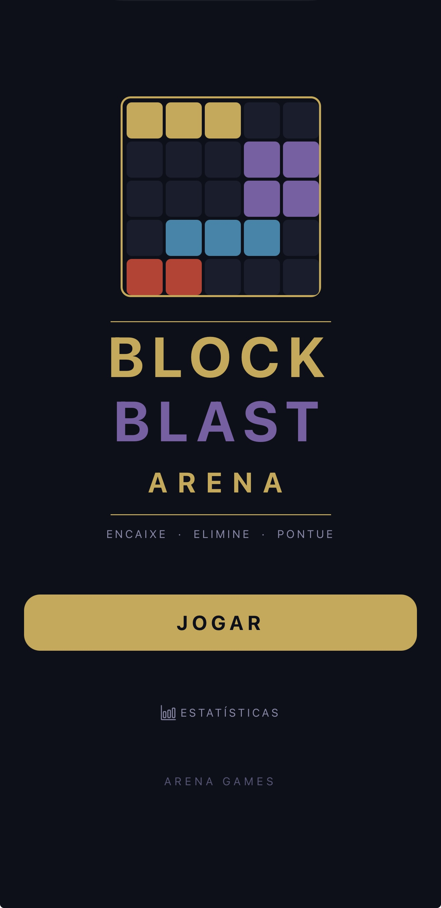
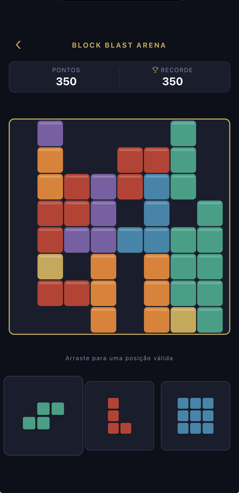
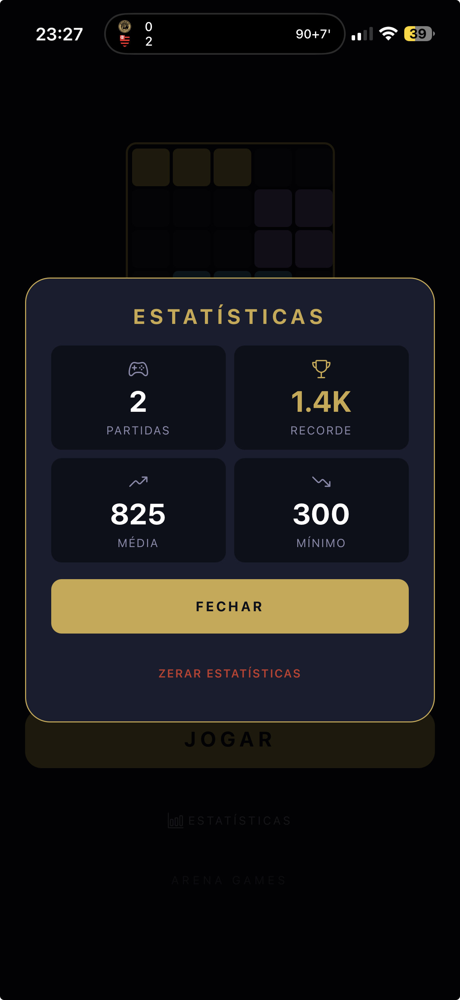
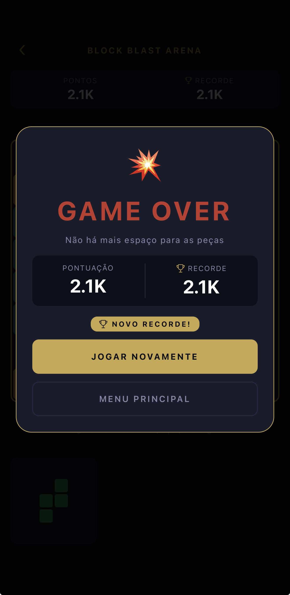

# 🟦 Block Blast Arena

Jogo de blocos casual para mobile — arraste peças para o grid 8×8, elimine linhas e colunas e bata seu recorde.

Parte da família **Arena Games** de jogos mobile.

---

## 📱 Screenshots

<p align="center">
  
  
  
  
</p>

---

## ✨ Funcionalidades

### Jogo
- Grid **8×8**
- **28 peças** diferentes: 1×1, 1×2, 1×3, 1×4, 1×5, quadrados 2×2 e 3×3, formas L, T, S/Z e cantos
- 3 peças disponíveis por vez — nova tray gerada ao usar todas
- **7 cores** distintas para as peças

### Interação
- **Arrastar e soltar** com PanResponder nativo (sem bibliotecas externas)
- Preview em tempo real da posição de encaixe enquanto arrasta
- Preview verde quando válido, vermelho quando inválido
- Animação de scale ao segurar a peça

### Pontuação
- 100 pts por linha/coluna eliminada
- Bônus por múltiplas linhas simultâneas
- **Multiplicador de combo** — eliminar em jogadas consecutivas

### Feedback
- Vibração ao soltar peça, eliminar linhas/colunas e game over
- **Animação de limpeza** — flash dourado → fade out nas células eliminadas

### Estatísticas
- Partidas jogadas
- Pontuação máxima (recorde)
- Pontuação média
- Pontuação mínima

---

## 🛠 Stack

- **React Native** + **Expo**
- **TypeScript**
- **Expo Router**
- **AsyncStorage** — persistência de estatísticas e recorde
- **expo-haptics** — feedback tátil
- **react-native-google-mobile-ads** — monetização
- **Animated API** — animações nativas

---

## 💰 Monetização (AdMob)

- **Banner** — rodapé da home e da tela de jogo
- **Interstitial** — a cada 3 partidas iniciadas

---

## 🚀 Como rodar

```bash
# Instale as dependências
npm install

# Rode em desenvolvimento
npx expo start
```

### Build Android

```bash
# APK para testes internos
eas build --platform android --profile preview

# AAB para a Play Store
eas build --platform android --profile production
```

---

## 📁 Estrutura

```
src/
├── app/
│   ├── _layout.tsx
│   ├── index.tsx          — home com recorde e estatísticas
│   └── game.tsx           — tela principal do jogo
├── components/
│   ├── GameGrid.tsx       — grid 8×8 com animações de limpeza
│   ├── PieceTray.tsx      — 3 peças draggable com PanResponder
│   ├── ScoreHeader.tsx    — pontuação, recorde e combo
│   └── AdBanner.tsx       — banner AdMob
├── constants/
│   └── theme.ts
├── hooks/
│   ├── useBlockBlast.ts   — estado, drag & drop e lógica do jogo
│   ├── useStats.ts        — estatísticas persistidas
│   ├── useHaptics.ts      — feedback tátil
│   └── useAdMob.ts        — interstitial
└── utils/
    └── pieces.ts          — definição das 28 peças e geração da tray
```

---

## 🎮 Como jogar

1. **Segure** uma das 3 peças da bandeja inferior
2. **Arraste** para o grid — o preview mostra onde vai encaixar
3. **Solte** numa posição válida para encaixar a peça
4. Quando uma **linha ou coluna** ficar completa, ela é eliminada e você pontua
5. Eliminar múltiplas linhas na mesma jogada gera **combo** e mais pontos
6. O jogo termina quando **nenhuma das 3 peças** couber no grid

---

## 🎨 Design System

| Token | Valor |
|---|---|
| Background | `#0D0F1A` |
| Surface | `#1A1D2E` |
| Primary (dourado) | `#C9A84C` |
| Secondary (roxo) | `#7B5EA7` |
| Error (vermelho) | `#C0392B` |

**Cores das peças:** dourado · roxo · azul · vermelho · verde · laranja · teal

---

## 📦 Dependências

```bash
npx expo install @react-native-async-storage/async-storage
npx expo install expo-haptics
npx expo install react-native-google-mobile-ads
```

---

## 📄 Licença

MIT © [ighorsantiago](https://github.com/ighorsantiago)